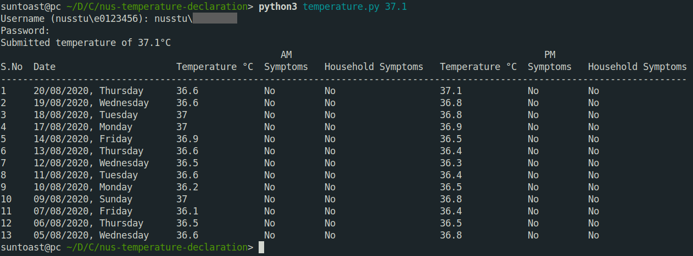
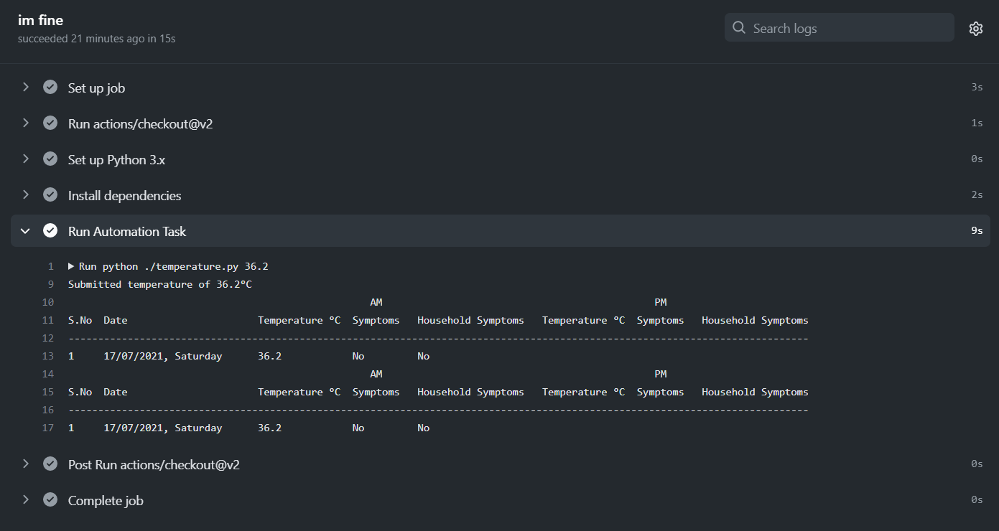

# nus-auto-health-checkin

一个自动化的体温上报python脚本，可以运行在Windows、Linux服务器，当然可以通过Github Actions进行自动化部署。**仅供学习，谨慎使用！**

An automated body temperature reporting python script that can run on Windows, Linux servers, and of course be deployed automatically via Github Actions. **For learning purposes only, use with caution!**

## Running locally or on server



## Running on Github Actions




## Usage

- The python package `beautifulsoup4` and `requests` need to be installed beforehand; you can install it using `pip3 install beautifulsoup4`.  and `pip3 install requests`
- 当然，你也可以选择不这么麻烦自己。You can also install it by using ` pip install -r requirements.txt` in the project fold.

- To declare your temperature, run `python temperature.py <temperature>`.

- To check your temperature, run `python temperature.py -c`.

## Setup (optional)

If you don't want to enter your username and password every time,  there are two options:

- You can store it in a text file: 

  - Copy `config-example.txt` to `config.txt`, replacing the username and password fields accordingly. PLEASE NOTICE that this way will expose your EXTREMELY IMPORTANT personal information to all the people. Do not use this scheme unless you are running this script on a private computer or on a trusted server that is private and secure.

  - Also, you need to modify codes of function `readUsernamePassword()` in the file `temperature.py` 

  - ```python
    def readUsernamePassword():
    	with open('config.txt', 'r') as f:
            d = dict(line.strip().split(': ') for line in f.readlines())
            if 'username' in d and 'password' in d:
                return d['username'], d['password']
    	
        username = input('Username (nusstu\e0123456): ')
        password = getpass('Password: ')
    	
        return username, password
    ```

- You can deploy this script via Github Actions and then store the important information in `Secrets`:

  - Fork this repository and activate action in the `Acions` tab

  - In the `Setting` tab, find the `Secret` tab and create new secrets named `USERNAME` and `PASSWORD` with the username and password starting with `nusstu\` respectively

  - Notice that the codes of function `readUsernamePassword()` in the file `temperature.py` is now:

  - ```python
    def readUsernamePassword():
        username = os.environ['USERNAME']
        password = os.environ['PASSWORD']
        return username, password
    ```

## The Dark Side

If you wish to automate your temperature declarations for whatever reason, you can put `auto.sh` in your crontab.

It acts a failsafe: if you haven't declared your temperature by then, it declares a random one for you. But if you've already declared your temperature for the day, it will have no effect.

This requires that you input your username and password in `config.txt` beforehand.
